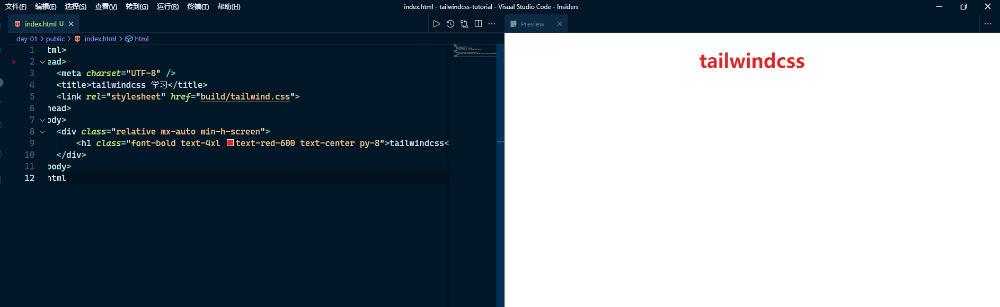

# 安装初始化

### 初始化项目

```shell
// 初始化项目目录，一路回车
yarn init

// 安装 tailwindcss
yarn add tailwindcss postcss-cli autoprefixer

// 初始化 tailwind 文件
npx tailwind init
```

### 配置 postcss

postcss 是一种对 css 编译的工具，当我们使用非标准 css 的时候都需要用这个工具进行最终的转换

在项目根目录下创建 postcss.config.js 文件

```javascript
module.exports = {
  plugins: [
    require("tailwindcss"),

    // autoprefixer 自动补全浏览器前缀
    require("autoprefixer")
  ]
};
```

### 引入 tailwind 基础功能

创建 css/tailwind.css 文件

```css
// 基础样式
@tailwind base;

// 组件
@tailwind components;

// 功能类
@tailwind utilities;
```

### 编译配置

配置编译命令，即将 css 样式编译为原生 css 文件

```javascript
// package.json
"scripts": {
    "build": "postcss css/tailwind.css -o public/build/tailwind.css"
}
```

执行编译命令，生成的原生 css 文件将存放在 public/build/tailwind.css 文件内

```shell
yarn build
```

然后我们就可以将原生的 css 文件按照正常的 html 加载 css 方式引入到网页中

### HTML 中引入原生 css

在 public 目录下创建 index.html

```html
<html>
<head>
    <link rel="stylesheet" href="build/tailwind.css">
<head>
</html>
```

### vscode 中实时预览网页效果

- 安装 Tailwind CSS IntelliSense 插件，以获得更好的 tailwind 编辑提示
- 安装 Preview on Web Server 插件，可以不用打开浏览器，在 vscode 中就能看到网页效果，非常适合学习 html 基础的同学
  在项目根目录我已经创建了 .vscode 目录，配置了 settings.json 文件，使用 ctrl + p 打开 vscode 顶部命令行，输入： >vscode-preview-server:preview on side panel
  就能看到如下效果
  
  编辑保存 html 后，右边会自动刷新状态
